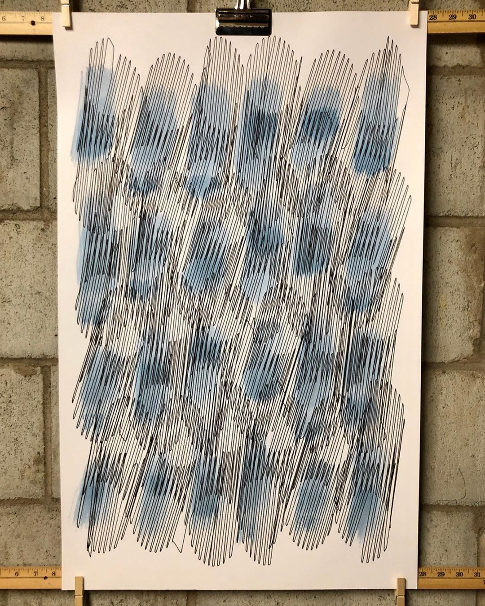

  Large format plotter built mostly from big box store parts. 

Documentation coming soon. For now:
<ul>
<li><a href="https://www.instagram.com/p/B_yHMaBBIrq/">Instagram post 4</a></li>
<li><a href="https://www.instagram.com/p/B_ukwqsBscZ/">Instagram post 3</a></li>
<li><a href="https://www.instagram.com/p/B_ujdGsBgf3/">Instagram post 2</a></li>
<li><a href="https://www.instagram.com/p/B--v_v9huLz/">Instagram post 1</a></li>

<!-- 

 -->
