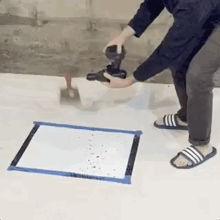

  Pendrillum is a homemade art improvement machine.

  Q: What does it look like to take a drill outside of the accepted spectrum of use, and even beyond what are considered
  to be <a href="https://www.youtube.com/watch?v=6och7-0iI00">unusual hacks</a>?

  A: A fish out of water

