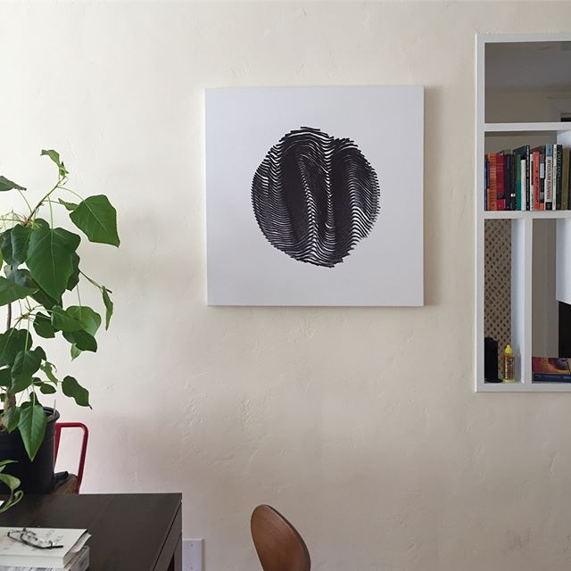
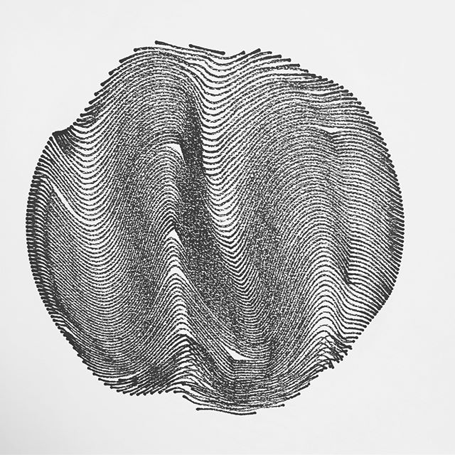
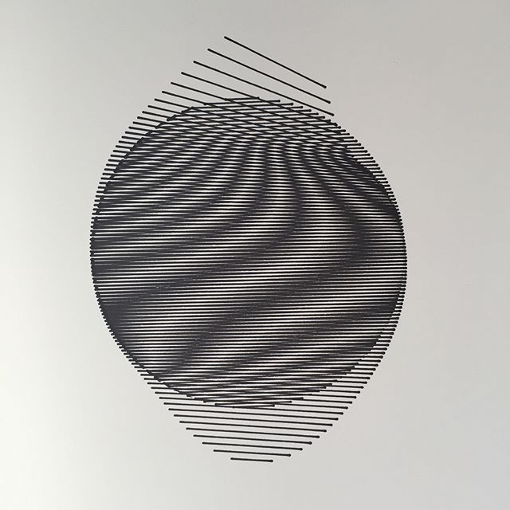
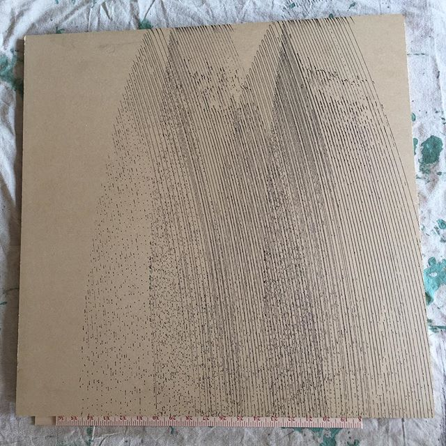
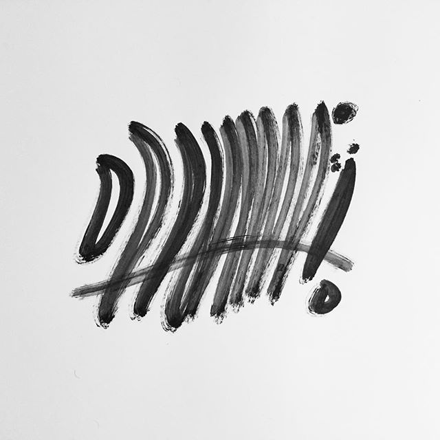
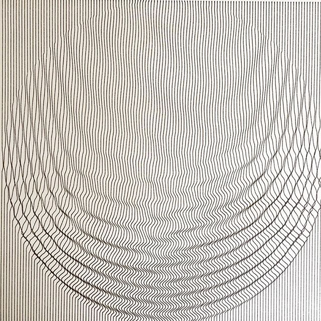
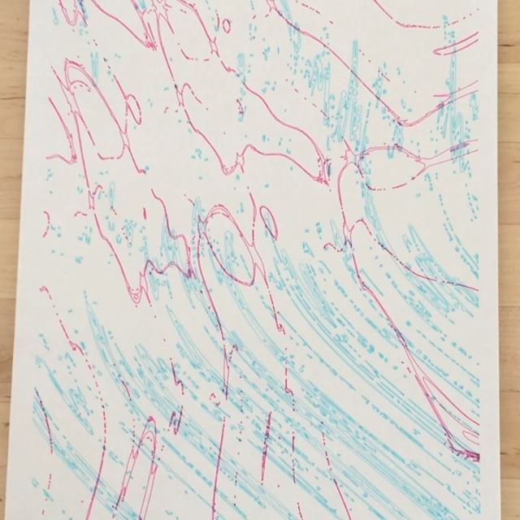
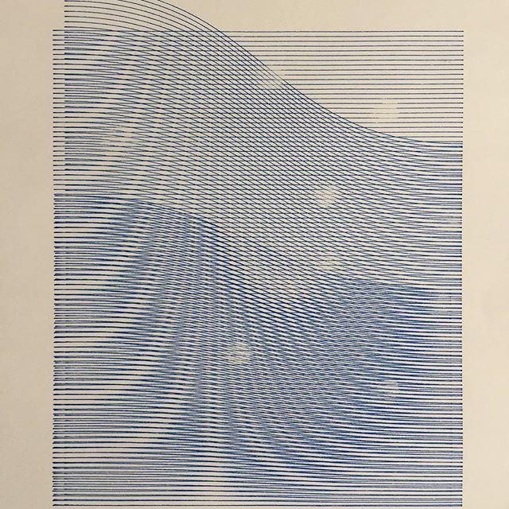

Plotter Art

In June 2017, in an attempt to break an over reliance on the computer, I acquired a small plotter. I spent the next two months experimenting. I gave it pens, markers, paints, and screw drivers which I then used to etch designs into wet paint. After a little while, I found myself wanting to make larger pieces, so I built a pantograph to multiply the reach of  the device 2-3x. Here is my documentation of those two months in reverse chronological order.What doesn't kill your plotter will make interesting art for a while but will ultimately probably kill your plotter.

Documentation of my art practice has moved to <a target="_blank" href="http://instagram.com/mjacobs/">Instagram</a>

<!-- document.querySelectorAll(".KL4Bh img").forEach((e,i)=> {
document.write("")
}) -->
